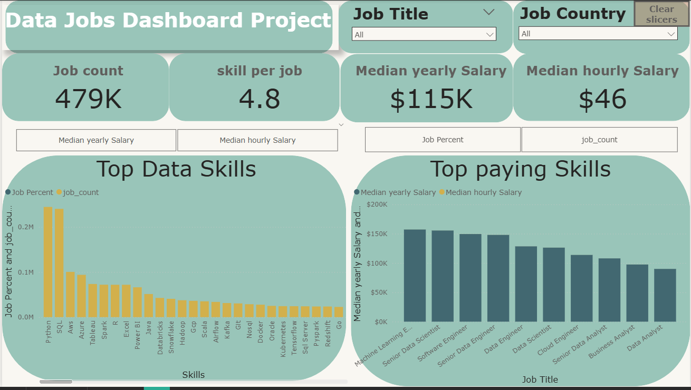

# Data jobs dashboard with power Bi

## Introduction 

Navigating the data job market can often feel overwhelming, with information spread across countless sources. This dashboard is built for job seekers, career switchers, and professionals exploring new opportunities, helping them cut through the noise. Powered by a real-world dataset of 2024 data science job postings—including detailed insights on roles, salaries, and locations—it delivers a streamlined, single-page experience for quickly understanding key market trends and compensation patterns.

---

## Skills Showcase

   This project showcases the practical application of key Power BI features. Here’s what was developed:

 - **🎨Dashboard Design**: Creating a clean, intuitive, and visually engaging report layout.

 - **⚙️ Power Query (ETL)**: Cleaning, transforming, and shaping data for analysis.

  - **🔗 Data Modeling**: Designing efficient data models using relationship structures based on star schema principles.

 - **🧮 DAX Fundamentals**: Building calculations and aggregations to extract meaningful insights.

- **📊 Visualizations Used**:

  - 📈 Core charts such as column, bar, line, and area charts to analyze comparisons and trends.
  - 🗺️ Map visuals for representing geospatial data.

   - 🔢 Cards to highlight key performance indicators at a glance.

   - 📋 Tables for displaying detailed, structured information.

   - 🎨 A mix of standard and advanced chart types to enhance data storytelling.

 - **🖱️ Interactive Features**:
   - 🎚️ Slicers for dynamic, user-driven filtering.
    - 🔘 Buttons and bookmarks to improve navigation and manage report views, including drill-through functionality.
---

## Dashboard Overview

*This second iteration streamlines the dashboard into a single, focused page, giving job seekers quick access to the most essential market insights at a glance.*

This page serves as a streamlined command center for exploring the data job market. It highlights key performance indicators (KPIs) such as job count, skills per job, median yearly salary, and median hourly salary. It also provides quick insights into skill popularity—by percentage or count—and enables easy comparison of salaries across different job titles, all within a clear and efficient overview.

---
## Conclusion
This updated dashboard demonstrates how Power BI can turn extensive job posting data into a powerful, streamlined tool for career analysis. It enables job seekers, career changers, and professionals exploring new opportunities to efficiently filter and explore key market insights within a single page—supporting more informed decisions about their next career move.

